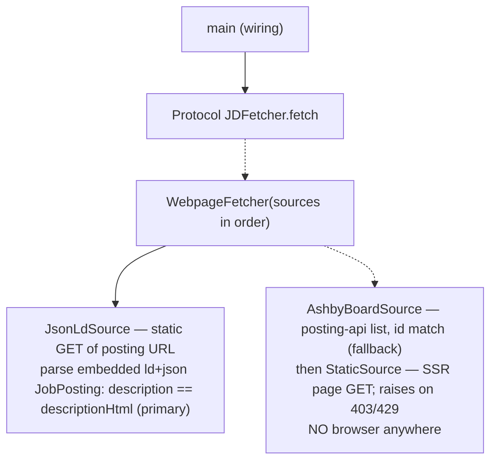

# resume-updater — implementation plan (Python rebuild — step 1: JD fetcher)

## 1. Context (SRP)

- Problem Statement: we need the full text of a single job posting, but nothing in the repo fetches a JD page.
- Business Value: a persisted, machine-readable JD file.
- Constraints — Technical: Python 3, macOS, minimal new deps. Time: step 1 only. Resources: no paid browser service.
- Success Criterion: on a live `jobs.ashbyhq.com/<org>/<id>` posting, `jd_fetch.py` writes a >1 KB markdown file containing the posting's title and full description text — zero browser; all tests green with zero live calls.

## 2. Current State (OCP)

- Existing Implementation: deleted Go pipeline — `HEAD:fetch.go:12-32` GETs the Ashby *posting-api job-list* JSON (`{"jobs":[...]}`), never an HTML page; `HEAD:PLAN.md` records "no single-job API (401 live-verified 2026-10-01)", so HTML fetch is the only per-JD path. `HEAD:fetch_test.go` shows the injected-transport stub pattern to reuse.
- Integration Point: `jd_fetch.py` writes the JD file consumed later.

## 3. Solution (LSP + ISP + DIP)

Approach: one standalone util, browserless. `jd_fetch.py <url> <out.md>` — GET the posting URL (plain `requests`) and parse the embedded `<script type="application/ld+json">` JobPosting: `description` is the full descriptionHtml (live-verified exact) → markdown under a `# <title>` header from the same JSON. No ld+json block: GET `https://api.ashbyhq.com/posting-api/job-board/<org>` (public JSON) and match the job id. Non-Ashby URL: static GET of an SSR page, HTML → markdown. All sources fail → raise with the last status — no rendering fallback exists.

```python
class PageSource(Protocol):                       # how JD text/HTML is obtained
    def html(self, url: str) -> str: ...
class JDFetcher(Protocol):                        # ISP: only what callers need
    def fetch(self, url: str, out: Path) -> Path: ...

class JsonLdSource:                               # primary: static GET + ld+json parse
    def html(self, url): ...                      # returns ld "description" (+ "title" for header)
class AshbyBoardSource:                           # fallback: public posting-api list, id match
    def html(self, url): ...
class StaticSource:                               # last: SSR page GET (non-Ashby)
    def html(self, url): ...                      # FetchBlocked on 403/429

class WebpageFetcher:
    def __init__(self, sources: list[PageSource]): ...
    def fetch(self, url, out):                    # <10 lines: first source that answers wins
        result, last = None, None
        for s in self.sources:
            try: result = s.html(url); break
            except FetchBlocked as e: last = e
        if result is None: raise last             # all sources failed → last status raises
        out.write_text(to_markdown(result)); return out
```

- Dependencies: `requests` (over httpx — one-shot sync GET only, async/http2 unused); `markdownify` (ld+json descriptionHtml → md; static-page HTML → md); `pytest` (tests). NO browser, NO automation lib, NO subprocess — all paths are plain HTTP.
- SOLID checks: ISP — each Protocol exposes exactly one method; DIP — callers are typed against `JDFetcher`, concretes injected at `main`; LSP — `JsonLdSource`/`AshbyBoardSource`/`StaticSource`/a stub swap in with no signature or caller change.
- Browserless fetch, verified live 2026-10-04: static GET of the posting URL embeds the WHOLE JD — `<script type="application/ld+json">` `description` parses to EXACTLY `descriptionHtml` (25,696 chars, normalized equality); `<meta name="description">` ≈ `descriptionPlain` (20,204 vs 20,167 chars). Rendered-DOM check: the page BODY never renders the JD (dump-dom body text lacks it — JD lives in meta/ld only), so a browser fallback is useless for Ashby; browserless is the only path that works. Fallbacks live-verified: `posting-api/job-board/<org>` list → 200, 62 jobs, descHtml per job; single-job endpoint → 401 (matches HEAD:PLAN.md). Generalizes: ramp board → 157 jobs, descHtml 7,341 chars. Verification note: raw-byte greps against JSON-LD undercount — `\uXXXX` escaping; compare PARSED JSON only.

## 4. Test Framework (test-first)

1. Happy: stub `JsonLdSource` returns ld+json `description` + `title` → `fetch` writes `.md` containing the title — fail reason: conversion/persist bug (SC: file persisted).
2. Error: source returns 403 → `FetchBlocked` raised, never a silent partial file — fail reason: silent error pass-through (SC: file persisted).
3. Integration boundary: `JsonLdSource` raises (no ld+json block) → `AshbyBoardSource` id-match used, file still written; all sources fail → last status raises — fail reason: fallback/raise wiring; zero network, no browser (SC: robust fetch).

## 5. Diagrams

One diagram — the plan covers exactly the one util.


